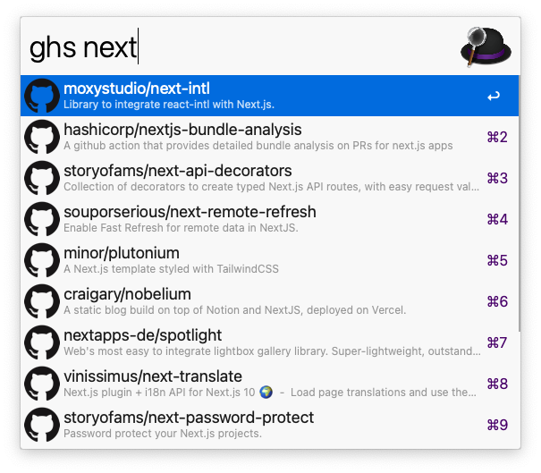

# alfred-github-stars

> [Alfred 3](https://www.alfredapp.com) workflow to search through the Github Stars.



## Install

```
$ npm install --global alfred-github-stars
```

_Requires [Node.js](https://nodejs.org) 6+ and the Alfred [Powerpack](https://www.alfredapp.com/powerpack/)._

## Usage

In Alfred, type `ghs`, <kbd>Enter</kbd>, and your query.

Select an item and press <kbd>Enter</kbd>.

## Options

To open the options run `npm install` inside this package directory.

### username

Your github username

### accessToken

Optional GitHub [access token](https://github.com/settings/tokens) to increase api limits.

## License

MIT © [Henrik Wenz](https://github.com/HaNdTriX)
